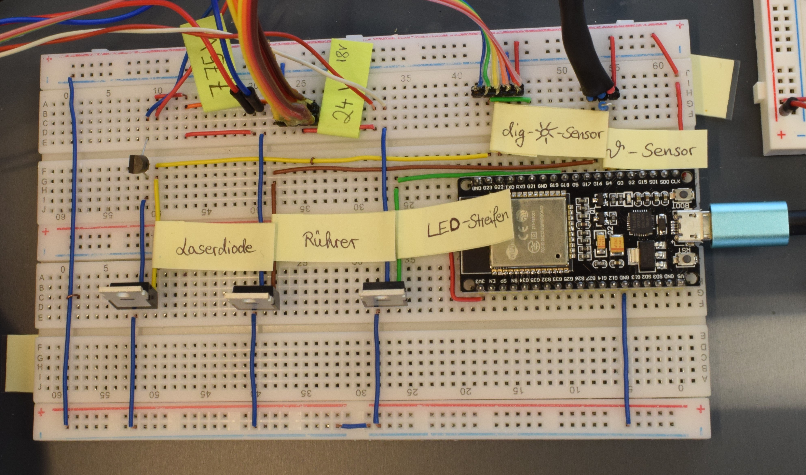
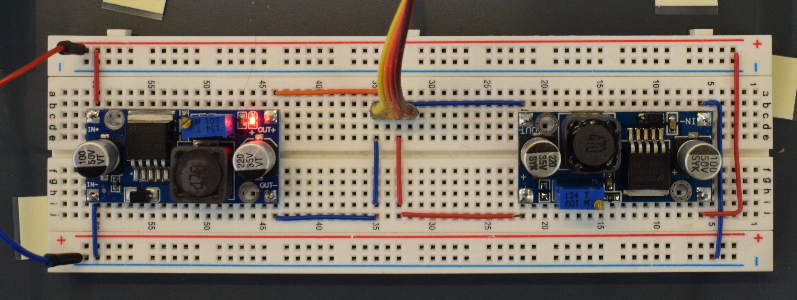
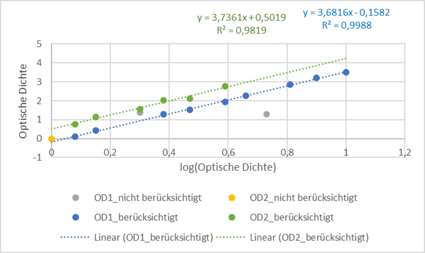
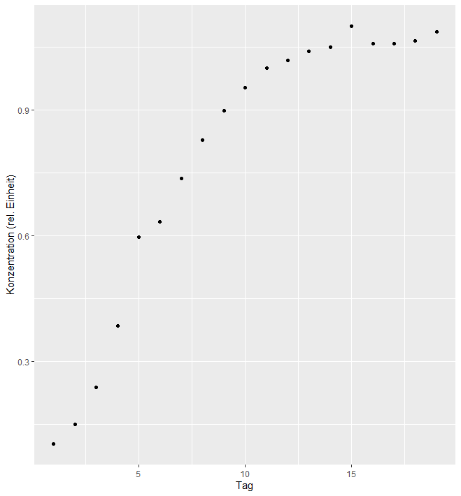
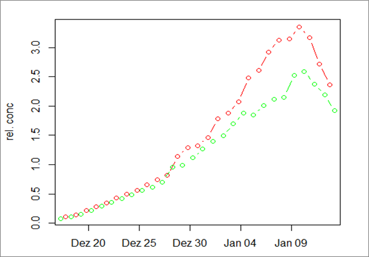
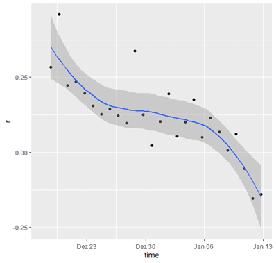

```{r setup, include=FALSE}
knitr::opts_chunk$set(echo = TRUE)
```


## Grundidee

Sachverhalte werden schneller verstanden und langfristig abgespeichert, wenn das Wissen praktisch angewendet wurde. Genau das ist das Ziel, das mit diesem Projekt erreicht werden sollte.

Beschrieben wird eine Apparatur, in der Wachstumsprozesse  einer Grünalgen-Batch-Kultur aufgezeichnet und anschließend visualisiert ausgewertet werden können. Verwendet wurde zur Konstruktion einfache Messeinrichtung ein unkomplizierter Aufbau sowie eine leicht zu verstehende und den Wunschvorstellungen entsprechend anpassbare Software.

Die Apparatur wurde für die Verwendung in schulischen und universitären Praktika entwickelt. Die Aufzeichnung von Wachstumskurven ist ohne großen Aufwand möglich. Zudem wird die Bedeutung von Kalibrierungen deutlich. Der Umgang mit Mikrocontrollern kann erlernt werden.


# Der Algen-Wachstumslogger


In diesem Experiment wurden drei baugleiche Apparaturen konstruiert. Diese sind in der obenstehenden Abbildung gezeigt. Durch die Plastik-Kisten sind sie voneinander abgeschirmt und können mit unterschiedlichen Lichtrhythmen betrieben werden ohne sich gegenseitig zu beeinflussen.
Verwendet wurden leicht erwerbbare Materialen, wie beispielsweise eine Grundplatte aus Sperrholz, Gewindestäbe und Muttern sowie Polystyrol als Standplatte für die Laborflasche mit der Algenprobe.

## Technik
Als technische Bauteile wurden handlesübliche sowie preisgünstige Geräte verwendet. Auf dem Steckbrett unten zeigt die Anordnung. Die Step-Down-Module transferieren die Netzteilspannung in die jeweils benötigte Spannung. Somit wurde den LED-Streifen mit dem rechten Modul eine Spannung von ca. 18V bereitgestellt. Die restlichen Bauteile wurden mit  7,75V betrieben.


Tabelle mit genauer Bezeichnung und Grund der Verwendung einfügen




## Schaltplan

Die Steckbrettanordnung wurde mit dem Programm [**fritzing**](https://fritzing.org/) digitalisiert, das ebenfalls auf [Github](https://github.com/fritzing/fritzing-app) frei verfügbar ist. 

  kann für eigene Erweiterungen angepasst werden.
](Hauptsteckbrett_Steckplatine_fritzing.png) 

## Software

Mit dem hier verlinkten R-Skript werden die Messungen in den Apparaturen gesteuert. Die LED-Streifen werden an- bzw. ausgeschaltet, die Temperatur wird aufgezeichnet, die Laserdiode wird im Messintervall eingeschaltet und zeitgleich werden die Informationen des digitalen Lichtsensors ausgewertet und die Messdaten zwischengespeichert.

hier R-Skript reinstellen

Anschließend werden die Daten derzeit an den zentralen Server der TU-Dresden übermittelt. Von dort aus kann auch aus externen Internetanbindungen, wie das häusliche W-LAN, auf den derzeitigen Stand der Messungen zugegriffen werden. In growthlab kann man den Zeitraum des zu betrachtenden Messintervalls einstellen. Es werden automatisch Diagramme erstellt, die die Temperaturmesswerte sowie die Messwerte des digitalen Lichtsensors in Abhängigkeit von der Zeit darstellen.


# Auswertung der Daten

## Kalibrierung

Formel zur Umrechnung der Messwerte in auswertbare relative Algenkonzentration


## Wachstumskurven

Die Wachstumskurven, die aus den bisher aufgezeichneten Daten erstellt werden konnten, zeigen einen typischen logistischen Verlauf. Auf eine anfängliche lag-Phase folgt die Phase des exponentiellen Wachstums. Nach etwa zwei Wochen ist die Maximalkonzentration erreicht. Das nachfolgende Diagramm zeigt lediglich die Meswerte, die um 18 Uhr aufgezeichnet wurden. Kleine Unregelmäßigkeiten sind auf geringe Messfehler der Messeinrichtung zurückzuführen.



Die Datenauswertung in RStudio bietet vielfältige Möglichkeiten, die Messwerte in Diagramme zu überführen. So können auch zu zwei unterschiedlichen Tageszeiten (beispielsweise früh und abends) die Messdaten ausgelesen werden. Im untenstehenden Diagramm sind die Messwerte um 6 Uhr grün sowie die Messwerte um 18 Uhr rot dargestellt. Somit lassen sich Anpassungen des Photosystems an Licht- / Dunkelverhältnisse veranschaulichen und erklären.



Aus dieser Wachstumskurve wird ersichtlich, dass die Probe nach etwa drei Wochen fällt die relative Konzentration der Algen wieder ab. Die Algenprobe ist in diesem Fall verklumpt, die maximale Konzetration wurde erreicht und es kam zum Algensterben.

## Weitere Möglichkeiten der Datenanalytik

Auch weiterführende Begriffe, wie Wachstumsrate und Verdopplungzeit lassen sich mit den aufgenommenen Daten graphisch darstellen. 
Das untenstehende Diagramm zeigt beispielhaft die Wachstumsrate. Auch hier lassen sich die Beobachtungen des zweiten Wachstumsdiagramms bestätigen. Mit zunehmender Zeit sinkt die Wachstumsrate; die Algen wachsen somit zunehmend langsamer. Schließlich fällt die Wachstumsrate unter Null, die Probe ist gekippt. 



## Literatur und Internetquellen

Morgenstern, K. (2019) Fritzing, Electronics made easy. https://fritzing.org/ abgerufen am 2021-01-23

[Fritzing-Entwurf der Steckbrettanordnung](https://github.com/tpetzoldt/growthlab/blob/master/circuits/algenlogger_hauptsteckbrett.fzz)

<hr></hr>

Diese Anleitung entstand im Rahmen von [Jugend Forscht](
Home - Stiftung Jugend forscht e. V.
www.jugend-forscht.de) (2021): Saramaria Schreib
(Autorin), Thomas Petzoldt (Betreuer, Maintainer). Das Dokument, Fotos, 
Skripte und Daten stehen unter der [CC BY 4.0](https://creativecommons.org/licenses/by/4.0/)- Lizenz.


