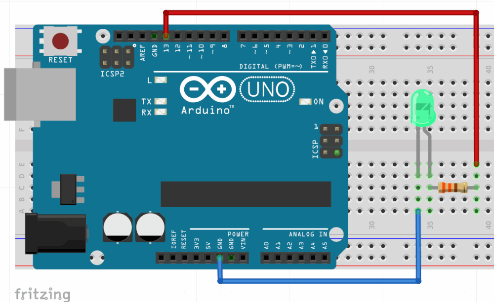
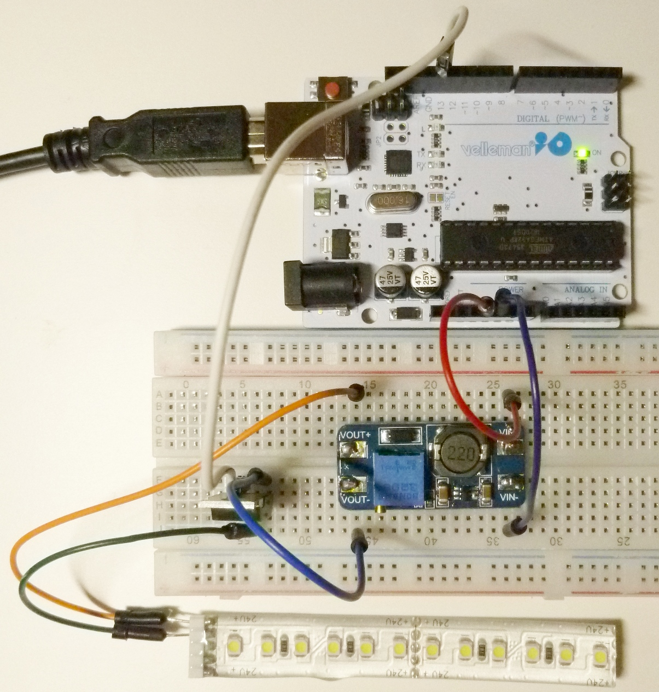

# Grundidee

Die Grundidee besteht darin, einen LED-Streifen zur Beleuchtung eines 
Wachstumsversuchs zu verwenden. Mit Hilfe eines Microcontrollers sollen unterschiedliche
Hell-Dunkel-Zyklen einstellbar sein, z.B. 12:12, 16:8 oder 2:2 Stunden.

Das Experiment ist als Schüler-, Studien- und Praktikumsexperiment vorgesehen. 
Bei entsprechend höherem Aufwand und Kosten für Mechanik, Optik und Elektronik 
ist eine Weiterentwicklung für Forschungszwecke denkbar, allerdings sind
solche Geräte bereits kommerziell erhältlich.

Im folgenden soll der Versuch, ausgehend von der Grundidee, schrittweise bis zur
Vollautomatisierung und zur Integration in ein Netzwerk (IoT -- Internet of Things)
vorgestellt werden.

Das hier vorgefundene Dokument stellt den jeweiligen Arbeitsstand dar.

# LED-Streifen

LED-Streifen sind in zahlreichen unterschiedlichen Versionen erhältlich, die sich durch Leistung, Lichtfarbe, und Versorgungsspannung unterscheiden. Die benötigte Leistung ist im Regelfall höher, als die vom Arduino oder ESP am digitalen Pin erreichbaren Werte, außerdem beträgt die Versorgungsspannung oft 12 oder 24V und nicht 3.3 oder 5V wie beim Mikrocontroller. Es sind deshalb Bauteile zur Steuerung etwas höherer Deistungen erforderlich.

Die folgende Anleitung beginnt zunächst mit der Steuerung von einfachen LEDs, anschließend wird das Experiment zur Steuerung etwas höherer Leistungen erweitert.


# Experiment 1 

Die einfachste Aufbaustufe zeigt bereits das Grundprinzip.

Als elektronische Bauelemente genügen neben der LED und dem Arduino ein sogenanntes *Breadboard* (Steckbrett),
1 Widerstand, 1 LED und ein paar Steckbrücken oder Basteldraht (0.5mm Durchmesser). Wichtig ist, dass
die LED  immer mit einem Vorwiderstand betrieben werden muss, sonst geht sie kaputt.





Eine detaillierte Einführung in die Mikrocontrollerprogrammierung würde den Rahmen dieses Projekts
sprengen. Die Installation Arduino-IDE sowie erste Gehversuche sind auf diversen Internetseiten sehr ausführlich beschrieben, z.B. auf https://www.arduino.cc/en/Guide/HomePage


### Einfaches Blink-Beispiel

Das Blink-Beispiel bringt zunächst die interne LED des Arduino zum blinken, 
anschließend soll eine externe LED an PIN 13 angesteuert werden. Der kürzere Pin der LED wird mit dem Minuspol (Masse) verbunden. Der längere Pin (Pluspol) wird über den Vorwiderstand (hier 300 Ohm) an Pin 13 des Arduino angeschlossen.


```{c eval=FALSE}
/*
  Control LED on an "Arduino Uno" compatible board
  Set IDE to Arduino/Genuino Uno
  License: public domain
*/

// The Arduino Uno internal LED is connected to pin 13    
#define LED_1 13

void setup() {
  pinMode(LED_1, OUTPUT);
}

// the loop function runs over and over again forever
void loop() {
  digitalWrite(LED_1, HIGH);
  delay(2000);
  digitalWrite(LED_1, LOW);
  delay(2000);
}
```

### Blink ohne Delay

Das folgende Beispiel verzichtet auf die "delay"-Funktion und verwendet stattdessen 
den Millisekunden-Zähler der internen Quarzuhr des Arduino. Das ist genauer, außerdem
wird der Programmfluss nicht durch "delay" unterbrochen. 
Somit lassen sich parallel Messaufgaben durchführen oder weitere LEDs mit unterschiedlichem 
Blinkintervall steuern.


```{c eval=FALSE}
/*
  Control LED on an "Arduino Uno" compatible board
  Set IDE to Arduino/Genuino Uno

  Code modified from:
  http://www.arduino.cc/en/Tutorial/BlinkWithoutDelay
  
  License: public domain
*/

// constants won't change. Used here to set a pin number:
const int ledPin =  13;// the number of the LED pin

// Variables will change:
int ledState = LOW;             // ledState used to set the LED

// Generally, you should use "unsigned long" for variables that hold time
// The value will quickly become too large for an int to store
unsigned long previousMillis = 0;        // will store last time LED was updated

// constants won't change:
const long interval = 1000;           // interval at which to blink (milliseconds)

void setup() {
  // set the digital pin as output:
  pinMode(ledPin, OUTPUT);
}

void loop() {
  // here is where you'd put code that needs to be running all the time.

  // check to see if it's time to blink the LED; that is, if the difference
  // between the current time and last time you blinked the LED is bigger than
  // the interval at which you want to blink the LED.
  unsigned long currentMillis = millis();

  if (currentMillis - previousMillis >= interval) {
    // save the last time you blinked the LED
    previousMillis = currentMillis;

    // if the LED is off turn it on and vice-versa:
    if (ledState == LOW) {
      ledState = HIGH;
    } else {
      ledState = LOW;
    }

    // set the LED with the ledState of the variable:
    digitalWrite(ledPin, ledState);
  }
}
```

## Aufgabe: Steuerung von 2 LEDs

Baue eine Schaltung auf, die 2 LEDs mit unterschiedlichem Blinkrhythmus steuert, z.B. 16:8 Sekunden
und 2:2 Sekunden. Arbeitsschritte:

* Aufbau der Schaltung
* Erweiterung des Code-Beispiels
* Ausprobieren
* Dokumentation von Schaltung und Code.

Zum Zeichnen des Codes kann entweder ein normales Grafikprogramm verwendet werden oder
das Programm Fritzing (https://fritzing.org). Die App wird zwar leider nicht mehr weiterentwickelt, leistet aber nach wie vor gute Dienste.


# Experiment 2

### Arduino steuert LED-Streifen

Für das folgende Experiment benötigen wir ein kurzes Stück eines LED-STreifens (24 V), 
ein DC-DC-Wandlermodul (Step-up Modul MT 3808) und einen Mosfet-Transistor (z.B- IRLZ 24N).

Die detaillierte Beschreibung der Schaltung muss noch geschrieben werden ...




----

**Copyright and original author:** [tpetzoldt](https://github.com/tpetzoldt), `r Sys.Date()`
