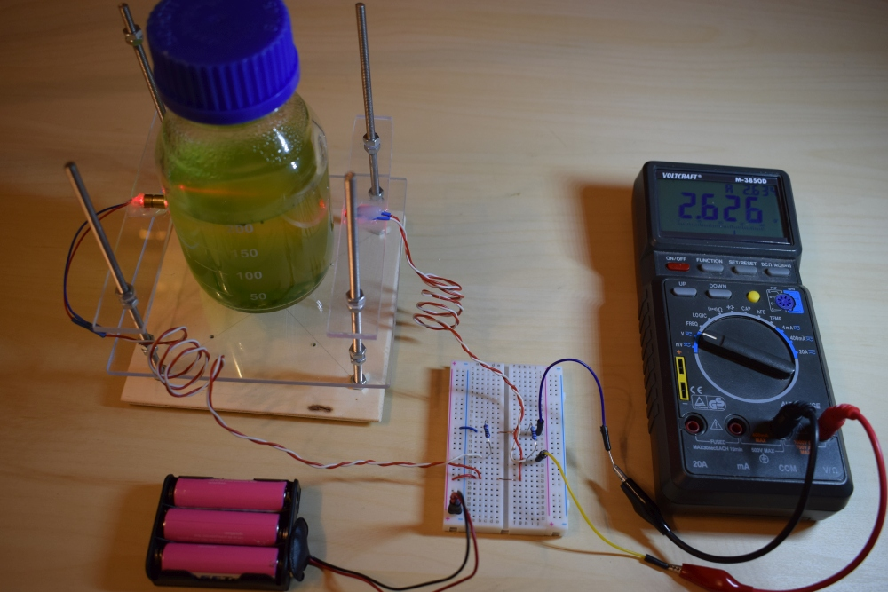
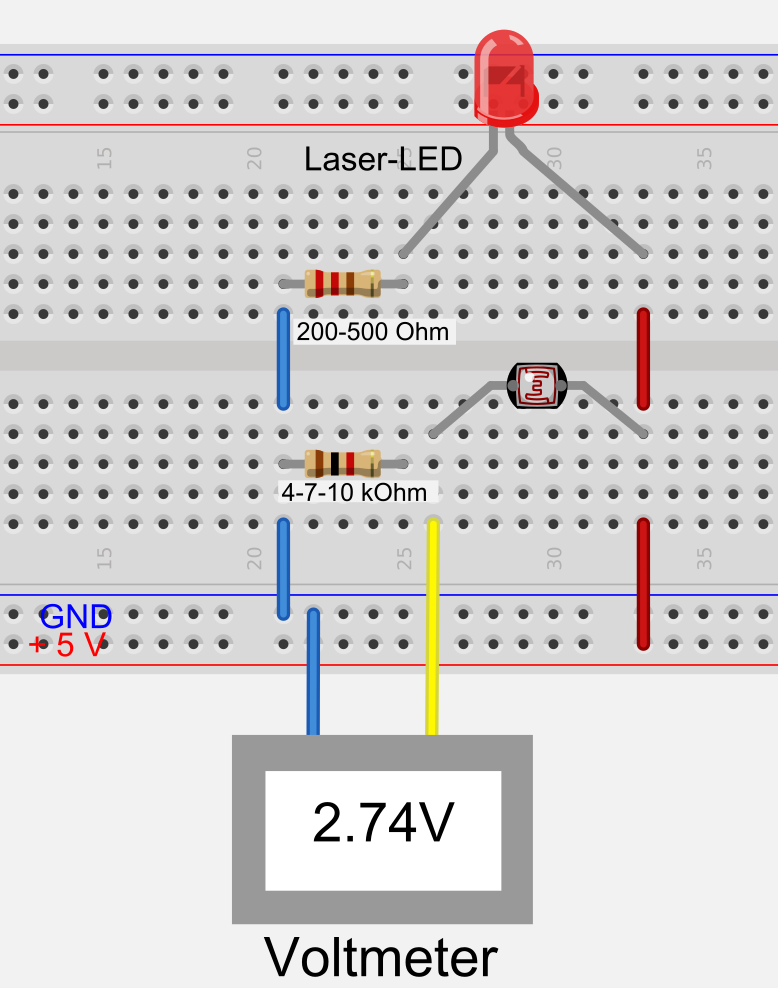
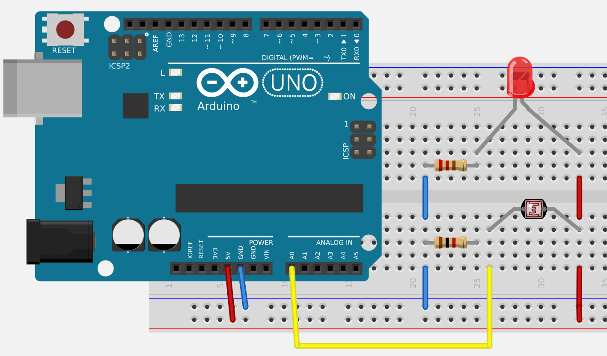
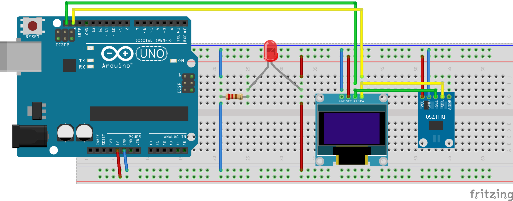
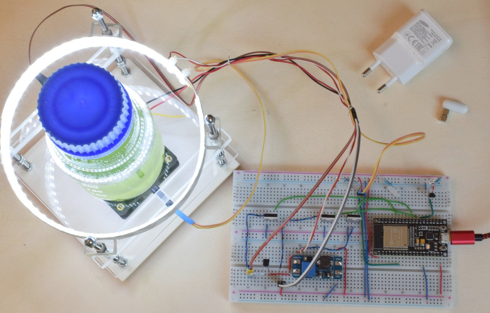
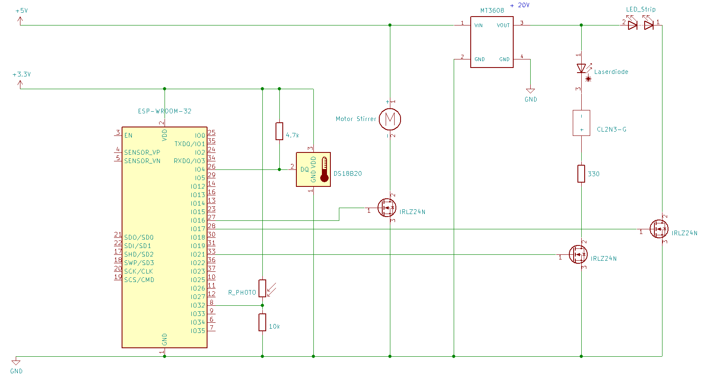

# Grundidee

Die Grundidee besteht im Prinzip aus einer "Lichtschranke", bestehend aus einer LED, 
einem Lichtsensor und einem Messgerät. Das Prinzip ähnelt einem Photometer, allerdings
wird auf Präzisionsoptik und -mechanik verzichtet, um einen kostengünstigen Nachbau
zu ermöglichen.

Im Unterschied zu einem typischen Photometer kann direkt durch das Glas 
der Flasche gemessen werden. Das ist zwar optisch ungünstiger als eine
Küvette, ermöglicht aber Messungen in geschlossenen Kolben oder Flaschen.

Je nach Ausbaustufe kann die Messung manuell erfolgen oder mit einem Mikrocontroller.
Dieser erlaubt gleichzeitig weitere Steuerungsaufgaben, z.B. Licht und Rührer.

Das Experiment ist als Schüler-, Studien- und Praktikumsexperiment vorgesehen. 
Bei entsprechend höherem Aufwand und Kosten für Mechanik, Optik und Elektronik 
ist eine Weiterentwicklung für Forschungszwecke denkbar, allerdings sind
solche Geräte bereits kommerziell erhältlich.

Im Folgenden soll der Versuch, ausgehend von der Grundidee, schrittweise bis zur
Vollautomatisierung und zur Integration in ein Netzwerk (IoT -- Internet of Things)
vorgestellt werden.

Die hier vorliegende Beschreibung stellt den jeweiligen Arbeitsstand dar.

# Phytoplanktonkultur

Für den Versuch wurde eine Laborkultur einer Grünalgenart aus der Gattung *Scenedesmus* verwendet. Diese ist sehr konkurrenzstark und kann unsteril kultiviert werden, was den Versuch sehr erleichtert. Prinzipiell kann man auch eine sogenannte Verdrängungskultur aus einer Freilandprobe ansetzen.

Als Nährlösung wurde ein handelsüblicher mineralischer Blumendünger benutzt. Hier kann man schon einmal das chemische Rechnen üben. Mehr dazu folgt später.

# Experiment 1 

### Manuelle Messung mit Voltmeter

Die einfachste Aufbaustufe zeigt bereits das Grundprinzip. Die Messtrecke wird durch eine
LED und ein Photowiderstand gebildet, die an einem
einfachen Gestell befestigt sind. Das Gestell besteht aus einer Sperrholzgrundplatte, 
Gewindestangen (M4) und etwas Plexiglas, es könnte im Prinzip aber auch aus einem Lego- oder Metallbaukasten stammen.

Als elektronische Bauelemente genügen neben der LED und dem Photowiderstand ein sogenanntes *Breadboard* (Steckbrett), 2 Widerstände, Steckbrücken bzw. etwas Draht und ein Voltmeter. Da nur Spannung gemessen werden muss, genügt ein preiswertes Gerät. Bei der LEDhandelt es sich um eine günstige rote Laser-LED, ähnlich einem Laserpointer. 
Die Laser-LED besitzt sogar eine kleine Linse zur Fokussierung. Grundsätzlich sind auch andere LEDs geeignet. Wichtig ist, dass eine LED immer mit einem Vorwiderstand oder einer Konstantstromquelle (siehe unten) betrieben werden muss, sonst geht sie kaputt. Laser-LEDs sind besonders empfindlich.

**Vorsicht:** Dass man einen Laser nicht auf die Augen oder auf spiegelnde Flächen 
richtet, sollte selbstverständlich sein. Achtung: auch die Flasche kann spiegeln!

Die grüne Farbe der Probe zeigt eine hohe Konzentration gegen Ende eines 
Wachstumsversuchs.

<!--
%
-->




<!--

-->

### Schaltung

Die Schaltung (rechts) zeigt die LED mit Vorwiderstand und für den Photowiderstand 
den typischen Aufbau einer Spannungsteilers. Spannungen lassen sich grundsätzlich 
einfacher und genauer messen als Ströme. Es empfiehlt sich, die Schaltung zunächst 
auf dem Steckbrett aufzubauen. Wenn alles funktioniert, werden LED und Photowiderstand 
mit längeren Leitungen versehen und am Gestell befestigt.

# Experiment 2 

### Messung mit einem Arduino Uno

Der [Arduino Uno](https://www.arduino.cc) und seine kompatiblen Nachbauten (nur Uno genannt) sind in der Mikrocontroller-Bastelszene die "Klassiker". Es gibt zwar inzwischen viel leistungsfähigere Controller: schneller, mehr Speicher, WLAN usw., aber der UNO ist nach wie vor weit verbreitet und besonders einfach zu programmieren.

Im folgenden Experiment wird das Voltmeter durch einen Uno ersetzt, die übrige 
Schaltung bleibt gleich. Die USB-Verbindung mit einem Computer hat eine dreifache Funktion:

- Stromversorgung des Uno (Spannung 5V) 
- Programmierung des Uno mit der [Arduino-IDE](https://www.arduino.cc/en/Main/Software) (IDE = ingegrierte Entwicklungsumgebung)
- Ausgabe der Daten auf dem Bildschirm mittels "Seriellem Monitor" bzw. "Seriellem Plotter" der Arduino-IDE




### Der Code

Eine Detaillierte Einführung in die Mikrocontrollerprogrammierung würde den Rahmen dieses Projekts übersteigen. Allerdings sind die Installation der Arduino-IDE und erste Gehversuche auf diversen Internetseiten sehr ausführlich beschrieben, z.B. auf https://www.arduino.cc/en/Guide/HomePage

Wenn man die IDE installiert hat und das Blink-Beispiel funktioniert, kann man 
sich bereits and das unten stehende Beispiel trauen. Die Messwerte des Sensors 
erscheinen dann als relative Einheiten auf dem Computer.

```{c eval=FALSE}
/*
  Arduino analog light sensor example
  Output can be shown via the Arduino serial monitor or serial plotter
  License: public domain
*/

int sensorPin = A0;    // pin number where analog input is connected

void setup() {
  Serial.begin(115200);
}

void loop() {
  float sensorValue = analogRead(sensorPin);
  Serial.print("Light: ");
  Serial.println(sensorValue);
  delay(100);
}
```

# Experiment 3

### Arduino mit digitalem Sensor und Display

Für das folgende Experiment benötigen wir einen digitalen Lichtsensor (BH1750) 
und ein OLED-Display (z.B. ein SH1106 mit 128 x 64 Pixeln), beide mit 
sogenannter I2C-Schnittstelle. Der Vorteil on I2C ist, dass man nur 4 Leitungen 
benötigt (Stromversorgung, Masse und 2 Datenleitungen) und dass man mehrere 
Schaltkreise einfach parallel schalten kann.

Prinzipiell sind auch andere Sensoren und Displays geeignet. In diesem Fall sind 
Schaltung und Code entsprechend anzupassen. Vorher sollte man die Chips 
mit den dazugeörigen Beispielen einzeln ausprobieren.




Die Abbildungen zeigen oben ein Foto (ohne die Laserdiodenschaltung) 
und unten den kompletten Schaltungsaufbau auf dem Breadboard. Zur Vermeidung von Kabelsalat
wurde der Sensor an ein Flachbandkabel gelötet. Für den Anschluss an den Arduino dienen 
vier Adern eines Dupont-Jumperkabels. Im Foto wurde im Interesse der Übersicht die 
Laserdiodenschaltung weggelassen. Der Versuchsaufbau lässt sich auch als behelfsmäßiges
Luxmeter einsetzen. Man beachte, dass die Stromversorgung über ein Netzteil oder eine Batterie erfolgen kann  (runde Buchse) und nicht über USB, d.h. die Schaltung ist nach der Programmierung autark ohne Computer lauffähig.

### Der Code

```{c eval=FALSE}
/*
  Combines the BH1750 digital Light sensor with an OLED display

  Purpose:
  - simple lux meter 
    (the values are of course not precise, but surprisingly close 
     to a commercial hobby lux meter)
  - in combination with a (laser) LED: digital light sensor for growth experiments

  Connection of light sensor and display to the controller
  The I2C interface allows to connect both in parallel.
  
  Sensor    Arduino Uno
  VCC        3V3
  GND        GND
  SDA        SDA
  SCL        SCL

  Note: available OLED displays have different pinout.
        Be very careful, NEVER CONFUSE 3.3V and GND!

  License: GPL 2.0
*/


//https://github.com/olikraus/u8g2/wiki/u8x8reference
#include <U8x8lib.h>   // OLED display library

// Create the Lightsensor instance
#include <BH1750FVI.h> // light sensor library

// enable one of the following lines to set resolution
BH1750FVI LightSensor(BH1750FVI::k_DevModeContLowRes);
//BH1750FVI LightSensor(BH1750FVI::k_DevModeContHighRes);

// change the following line if you own a different display
U8X8_SH1106_128X64_NONAME_HW_I2C u8x8(/* reset=*/ U8X8_PIN_NONE);

void setup() {
  Serial.begin(9600);
  LightSensor.begin();  

  /* Initialize OLED display */
  u8x8.begin();
  u8x8.setPowerSave(0);
  u8x8.setFont(u8x8_font_7x14_1x2_r);
  u8x8.drawString(0,0,"Start ...");
  delay(100);
  u8x8.clearDisplay();
}

void loop() {
  uint16_t lux = LightSensor.GetLightIntensity();

  // Output to Serial monitor or plotter of the Arduino IDE
  Serial.print("Light: ");
  Serial.println(lux);

  // Output to the OLED display
  u8x8.drawString(0, 2,"Light          "); //overwrite leftover chars from lux
  u8x8.drawString(7, 2, String(lux).c_str());
  delay(1000);
}

```


# Experiment 4

### Internet of Things: Automatische Messeinrichtung mit WLAN

Die oben beschriebene Versuchsanordnung lässt sich beliebig anpassen und erweitern. 
In einer weiteren Ausbaustufe soll der Controller vollautomatisch agieren und die
Messdaten abspeichern. Da der Uno hier schnell an seine Grenzen gelangt, sollte man
einen leistungsfähigen Controller einsetzen, z.B. einen ESP8266 oder einen ESP32.
Entwicklerboards mit diesen Controllern sind kaum teurer als ein Arduino, bieten 
jedoch viel mehr Leistung: kleiner, schneller, mehr Speicher, flexiblere Schnittstellen, 
WLAN, Bluetooth, Stromsparfunktionen.

Für den folgenden Aufbau wurde ein "ESP32 Dev Kit C" verwendet. Er steuert folgende Funktionen:

* Messung der optischen Dichte (mit Photowiderstand)
* Messung der Temperatur mit ein ider mehreren digitalen temperatursensoren (DS18B20)
* An- und ausschalten der Laserdiode
* Steuerung der Beleuchtung (eines LED-Streifens): An/Aus, Helligkeit
* Steuerung eines Magnetrührers
* Zeitsynchronisation von einem Internet-Zeitserver
* WLAN-Übertragung von Messdaten und Steuerinformationen überdas MQTT-Protokoll 
  an einen Datenbankserver.
* Möglichkeit, die Steuerungssoftware im laufenden Betrieb "over the air" 
  (OTA per WLAN) zu aktualisieren. Über diesen Weg lassen sich z.B. das Messintervall
  oder das Rühr- oder Lichtregime (Dauerlicht, 16:8, gepulst) verändern.





### Spannungs- und Stromversorgung

Die für den Versuchsaufbau verwendeten Bauelemente benötigen unterschiedliche 
Spannungen (z.B. 3.3V. 5V, 12V, 24V) und Ströme. Während der ESP32 und die Sensoren 
3.3V benötigen (und keinesfalls mehr als 3.6V), benötigt der verwendete Rührermotor 5V
und die LED-Streifen je nach Typ 12V oder 18-24V.

Diese unterschiedlichen Anforderungen wurden wie folgt gelöst.

#### Spannung

* 5V: der ESP32 wird über seinen USB-Eingang mit 5V aus einem Handynetzteil versorgt. 
  Der interne Spannungsregler des "Dev Boards" stellt daraus die 3.3V her.
* 3.3V: Die Sensoren (Photowiderstand, Temperatursensoren) müssen mit dem selben 
Pegel arbeiten wie der ESP. Die dafür benötigte Spannung wird vom 3.3V-Ausgang 
des "Dev Boards" abgezweigt.
* 12V bzw. 24V: Hierzu wird ein kleines aber sehr effizientes Transformatormodul
benutzt (MT3608 DC-DC Step up Modul, auf dem Foto die kleinere Platine). 
Mit Hilfe eines Einstellpotentiometers (blaues Bauteil auf der Platine) 
lässt sich die gewünschte Ausgangsspannung einstellen. Je nach Leistungsfähigkeit der Handy-Netzteils und der maximalen Leistungsaufnahme des LED-Streifens kann die volle Leistung eventuell nicht ganz abgerufen werden, damit für den ESP und die anderen Bauteile genügend Strom übrigbleibt. Im vorliegenden Fall wird der 24V-LED-Streifen nur mit 20V betrieben.

Details sind dem Schaltplan und der folgenden Erläuterung zu entnehmen.

#### Stromstärke

Motoren und LEDs benötigen eventuell mehr Strom (und ggf. eine andere Spannung) 
als der ESP32 von sich aus bereitstellen kann. Prinzipiell kann man das mit Relais lösen.
Als energiesparendere (und billigere) Alternative wurden für diesen Zweck Transistoren verwendet, konkret MOSFETS vom Typ IRLZ24N, oder ein ähnlicher Typ. Sie bieten für den Verwendungszweck genügend Leistungsreserven.

Mit Hilfe der MOSFETs lassen sich die jeweils benötigten Spannungen und Ströme schalten.

#### Temperaturabhängigkeit

Laser-LEDs sind stark temperaturabhängig. Bei einem ersten Versuch kam es trotz 
temperiertem Raum zu relativ starken Schwankungen des Messsignals. Eine vorgeschaltete
Konstantstromquelle (CL2N3-G, 20mA, 0.6W) konnte die Temperaturabhängigkeit sehr stark vermindern.
Das Bauteil hat 2 beschaltete Pins und wird einfach in Reihe zum Laser eingefügt. 
Da am Bauteil jedoch immer ein gewisser Spannungsabfall stattfindet, benötigt 
man nun allerdings eine Spannung von mindestens circa 7 Volt, so dass die Laser-LED
nun über die 12 bzw. 20V-Leitung versorgt werden muss. Ein zusätzlicher Vorwiderstand 
(33o Ohm) sorgt dafür, dass bei 20V die Verlustleistung nicht allein 
an der Konstantstromquelle abfällt.

#### Rührer

Als Rührer kommt ein Selbstbau-Magnetrührer zum Einsatz, bestehend aus 
einem kleinen PC-Lüfter mit aufgeklebten Neodym-Magnetwürfeln. Da Motoren selbst 
Magnete besitzen, funktioniert das nur bei bestimmten Typen (vorher ausprobieren).

Im Versuchsgefäß befindet sich ein handelsüblicher Labor-Magnetrührer 
(sogenannter [Rührfisch](https://de.wikipedia.org/wiki/Magnetr%C3%BChrer)) 
oder ein Selbstbau aus Schrumpfschlauch, Magnetwürfeln und Kleber.

Alternativ kann man auch einen Rührer von oben bauen, z.B. aus einem kleinen Motor und dem Stempel einer Einwegspritze, oder eine Belüftung mit Hilfe einer Niederspannungs-Aquarienpumpe.

# Schüler- und Studienprojekte

## Organismen und Nährmedien

* Planktonkultur: Untersuchung unterschiedlicher Algenarten
* Nährmedien: In welchem Nährmedium wachsen die Algen am besten
* Lichtregime: Wachstum bei Dauerlicht und im Tag-Nacht-Rhythmus
* Verbesserung von Mechanik, Optik und Elektronik
* Verbesserung der Software


## Datenanalyse und Statistik

* Datenmanagement
* Kalibrierung
* Plotten, Zeitreihen, Glättung
* ANOVA-Beispiel
* Webseite zum Nachmachen

## Zusätzliche Programme und Scripte

* MQTT-Server auf einem Raspberry Pi
* Python-Server-Script und MariaDB-Datenbank
* Visualisierung mit R und Shiny


----

**Copyright and original author:** [tpetzoldt](https://github.com/tpetzoldt), `r Sys.Date()`
