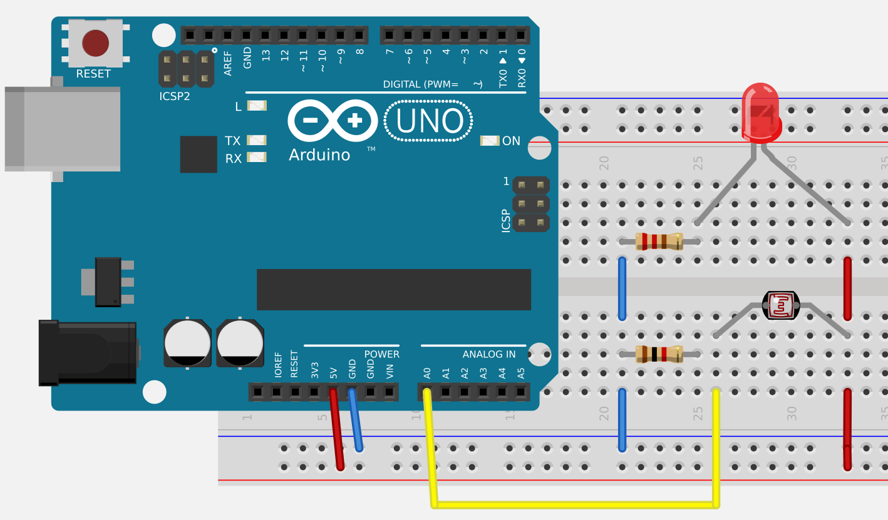

# Grundidee

Die Grundidee besteht praktisch in einer "Lichtschranke", bestehend aus einer LED 
einem Lichtsensor und einem Messgerät. Das Prinzip ähnelt einem Photometer, allerdings
wird auf Präzisionsoptik und -mechanik verzichtet, um einen kostengünstigen Nachbau
zu ermöglichen.

Außerdem kann im Unterschied zu einem typischen Photometer direkt durch das Glas 
der Flasche gemessen werden. Das ist optisch zwar wesentlich ungünstiger als eine
Küvette, ermöglicht jedoch Messungen in geschlossenen Kolben oder Flaschen.

Je nach Ausbaustufe kann die Messung manuell erfolgen oder mit einem Mikrocontroller.
Dieser erlaubt dann auch weitere Steuerungsaufgaben, z.B. Licht und Rührer.

Das Experiment ist als Schüler-, Studien- und Praktikumsexperiment vorgesehen. 
Bei entsprechend höherem Aufwand und Kosten für Mechanik, Optik und Elektronik 
ist wäre eine Weiterentwicklung für Forschungszwecke denkbar, allerdings sind
solche Geräte bereits kommerziell erhältlich.

Im folgenden soll der Versuch, ausgehend von der Grundidee, schrittweise bis zur
Vollautomatisierung und zur Integration in ein Netzwerk (IoT -- Internet of Things)
vorgestellt werden.

Das hier vorgefundene Dokument stellt den jeweiligen Arbeitsstand dar.

# Phytoplanktonkultur

Im vorliegenden Fall wird eine Kultur der Grünalge *Scenedesmus* verwendet. Diese 
Art ist sehr konkurrenzstark und kann unsteril gehalten werden, was den Versuch sehr 
erleichtert. Prinzipiell kann man auch eine sogenannte Verdrängungskultur aus einer
Freilandprobe ansetzen.

Als Nährlösung wird ein handelsüblicher mineralischer Blumendünger 
benutzt. Hier kann man schon einmal das chemische Rechnen üben. Mehr dazu folgt später.

# Experiment 1: Manuelle Messung mit einem Voltmeter

Die einfachste Aufbaustufe zeigt bereits das Grundprinzip. Die Messtrecke wird durch eine
LED und ein Photowiderstand gebildet, die in einem
Gestell befestigt sind. Das Gestell besteht im vorliegenden Fall aus einer Sperrholzgrundplatte, 
Gewindestangen (M4) und etwas Plexiglas, könnte im Prinzip aber auch aus dem Lego- oder Metallbaukasten stammen.

Als elektronische Bauelemente genügen neben der LED und dem Photowiderstand ein sogenanntes *Breadboard* (Steckbrett),
2 Widerstände, Steckbrücken bzw. etwas Draht und ein Voltmeter. Da nur Spannung gemessen werden muss, genügt ein preiswertes Gerät. Zur LED ist zu sagen, dass es sich hier um eine preiswere Laser-LED (ähnlich einem Laserpointer) handelt. 
Diese besitzt sogar eine kleine Linse zur Fokussierung. Grundsätzlich sind auch andere LEDs geeignet. Wichtig ist, dass
jede LED mit einem Vorwiderstand oder einer Konstantstromquelle (siehe unten) betrieben werden muss, sonst geht sie kaputt. Laser-LEDs sind besonders empfindlich.

**Vorsicht:** Das man einen Laser nicht auf die Augen oder auf spiegelnde Flächen 
richtet, sollte selbstverständlich sein. Achtung: auch die Flasche kann spiegeln!

Die grüne Farbe der Probe zeigt eine hohe Konzentration gegen Ende eines 
Wachstumsversuchs.

<!--
%
-->


<!--

-->


Die Schaltung (rechts) zeigt für die LED den Vorwiderstand und für den Photowiderstand 
den typischen Aufbau einer Spannungsteilers. Spannungen lassen sich grundsätzlich 
einfacher und genauer messen als Ströme. Es empfiehlt sich, die Schaltung zunächst 
auf dem Steckbrett aufzubauen. Wenn alles funktioniert, werden LED und Photowiderstand 
mit längeren Leitungen versehen und am Gestell befestigt.

# Experiment 2: Messung mit einem Arduino Uno

Der Arduino Uno und seine kompatiblen Nachbauten (nur Uno genannt) sind Microcontroller-Bastelszene
praktisch die "Klassiker". Es gibt inzwischen zwar viel leistungsfähigere Controller: schneller, mehr Speicher, WLAN usw., aber der UNO ist nach wie vor weit verbreitet und besonders einfach zu programmieren.

Im folgenden Experiment wird das Voltmeter durch einen Uno ersetzt, die übrige 
Schaltung bleibt gleich. Die USB-Verbindung mit einem Computer hat gleich dreifache Bedeutung:

- Stromversorgung des Uno (Spannung 5V) 
- Programmierung des Uno mit der Arduino-IDE (IDE = ingegrierte Entwicklungsumgebung)
- Ausgabe der Daten auf dem Bildschirm mittels "Seriellem Monitor" bzw. "Seriellem Plotter" der Arduino-IDE




## Der Code

Eine Detaillierte Einführung in die Mikrocontrollerprogrammierung würde den Rahmen dieses Projekts
sprengen. Die Installation Arduino-IDE sowie erste Gehversuche sind auf diversen Internetseiten sehr ausführlich beschrieben, z.B. auf https://www.arduino.cc/en/Guide/HomePage

Wenn man die IDE installiert hat und das Blink-Beispiel funktioniert, kann man 
sich bereits and das unten stehende Beispiel trauen. Die Messwerte des Sensors 
erscheinen dann als relative Einheiten auf dem Computer.

```{C++}
/*
  Arduino analog light sensor example
  Output can be shown via the Arduino serial monitor or serial plotter
  License: public domain
*/

int sensorPin = A0;    // pin number where analog input is connected

void setup() {
  Serial.begin(115200);
}

void loop() {
  float sensorValue = analogRead(sensorPin);
  Serial.print("Light: ");
  Serial.println(sensorValue);
  delay(100);
}
```

# Experiment 3: Arduino mit digitalem Lichtsensor und eigenem Display

Für das folgende Experiment benötigen wir einen digitalen Lichtsensor (BH1750) 
und ein OLED-Display (z.B. ein SH1106 mit 128 x 64 Pixeln), beide mit 
sogenannter I2C-Schnittstelle. Der Vorteil on I2C ist, dass man nur 4 Leitungen 
benötigt und dass man beide Schaltkreise einfach parallel schalten kann.

Prinzipiell sind auch andere Sensoren und Displays geeignet. In diesem Fall sind 
Schaltung und Code entsprechend anzupassen. Vorher sollte man die Chips 
mit den dazugeörigen Beispielen einzeln ausprobieren.


Die Abbildungen zeigen oben ein Foto (ohne die Laserdiodenschaltung) 
und unten den kompletten Schaltungsaufbau auf dem Breadboard. Zur Vermeidung von Kabelsalat
wurde der Sensor an ein Flachbandkabel gelötet. Für den Anschluss an den Arduino dienen vier 
Adern eines Dupont-Jumperkabels. Im Foto wurde im Interesse der Übersicht die 
Laserdiodenschaltung weggelassen. Der Versuchsaufbau lässt sich auch als behelfsmäßiges
Luxmeter einsetzen.


```{C++}
/*
  Combines the BH1750 digital Light sensor with an OLED display

  Purpose:
  - simple lux meter 
    (the values are of course not precise, but surprisingly close 
     to a commercial hobby lux meter)
  - in combination with a (laser) LED: digital light sensor for growth experiments

  Connection of light sensor and display to the controller
  The I2C interface allows to connect both in parallel.
  
  Sensor    Arduino Uno
  VCC        3V3
  GND        GND
  SDA        SDA
  SCL        SCL

  Note: available OLED displays have different pinout.
        Be very careful, NEVER CONFUSE 3.3V and GND!

  License: GPL 2.0
*/


//https://github.com/olikraus/u8g2/wiki/u8x8reference
#include <U8x8lib.h>   // OLED display library

// Create the Lightsensor instance
#include <BH1750FVI.h> // light sensor library

// enable one of the following lines to set resolution
BH1750FVI LightSensor(BH1750FVI::k_DevModeContLowRes);
//BH1750FVI LightSensor(BH1750FVI::k_DevModeContHighRes);

// change the following line if you own a different display
U8X8_SH1106_128X64_NONAME_HW_I2C u8x8(/* reset=*/ U8X8_PIN_NONE);

void setup() {
  Serial.begin(9600);
  LightSensor.begin();  

  /* Initialize OLED display */
  u8x8.begin();
  u8x8.setPowerSave(0);
  u8x8.setFont(u8x8_font_7x14_1x2_r);
  u8x8.drawString(0,0,"Start ...");
  delay(100);
  u8x8.clearDisplay();
}

void loop() {
  uint16_t lux = LightSensor.GetLightIntensity();

  // Output to Serial monitor or plotter of the Arduino IDE
  Serial.print("Light: ");
  Serial.println(lux);

  // Output to the OLED display
  u8x8.drawString(0, 2,"Light          "); //overwrite leftover chars from lux
  u8x8.drawString(7, 2, String(lux).c_str());
  delay(1000);
}

```


# Ausblick: Internet of Things: Automatische Messeinrichtung mit WLAN


# Tipps und Tricks

## Biologie

* Planktonkultur
* Nährmedien
* Versuchsideen

## Elektronik

* Temperaturabhängigkeit von Sensor und Laserdiode
* Bau eines Rührers
* Spannungsversorgung von LED-Streifen

## Programmierung

* Arduino / ESP
* Raspberry Pi
* Python-Server-Script und MariaDB-Datenbank
* Visualisierung mit R und Shiny

## Datenanalyse und Statistik


