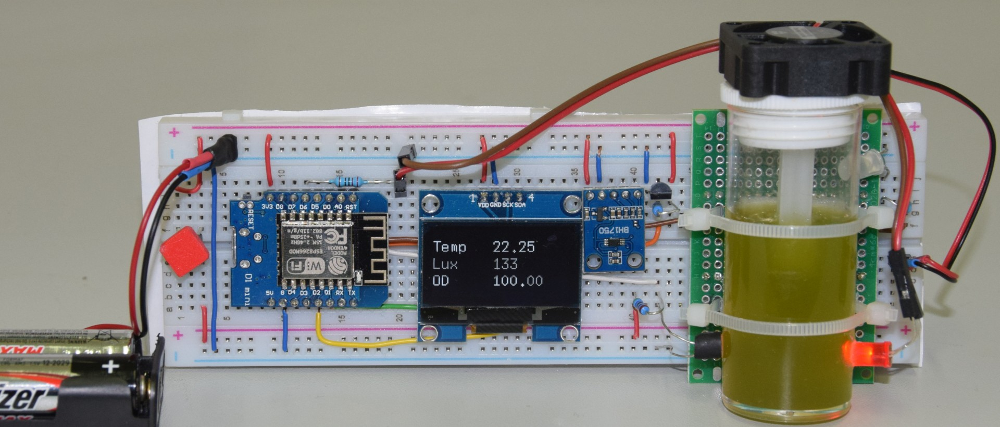

---
pagetitle: growthlab -- Reale und virtuelle Wachstumsexperimente für Schule und Studium
--- 

## Reale und virtuelle Wachstumsexperimente für Schule und Studium

Das Projekt verfolgt das Ziel, Wachtumsprozesse von Organismen zu veranschaulichen. Hierfür werden verschiedene Versuche entwickelt und praktisch getestet, von der einfachen
Trübungsmessung bis hin zum vernetzten mikroprozessorgesteuerten Messsystem.
Zusätzlich zur Hard- und Software werden auch die gewonnenen Daten und Erfahrungen geteilt.

### Grundideen

* [Ein Arduino steuert das Licht](doc/blink.html)
* [Versuchsaufbau: Steuerung, Sensoren, Daten](doc/versuchsaufbau.html)

### Schülerprojekte

* [Jugend Forscht-Projekt 2019/2020 -- Wachstumsversuche:](doc/petzoldt_belger_2019.pdf) Experimente zur Messung des Wachstums einer Phytoplanktonpopulation
* [Jugend Forscht-Projekt 2020/2021 -- Algenlogger:](doc/algenlogger.html) Versuchsoptimierung, Kalibrierung und Langzeitexperimente

### Quelltexte, Software und Bilder

* [Software-Repository](https://github.com/tpetzoldt/growthlab/)

Note to English speaking people: This repository is mainly in German to 
support educational use in Germany. Translations are welcome.

[Maintainer: tpetzoldt](https://github.com/tpetzoldt) 2021-01-14
